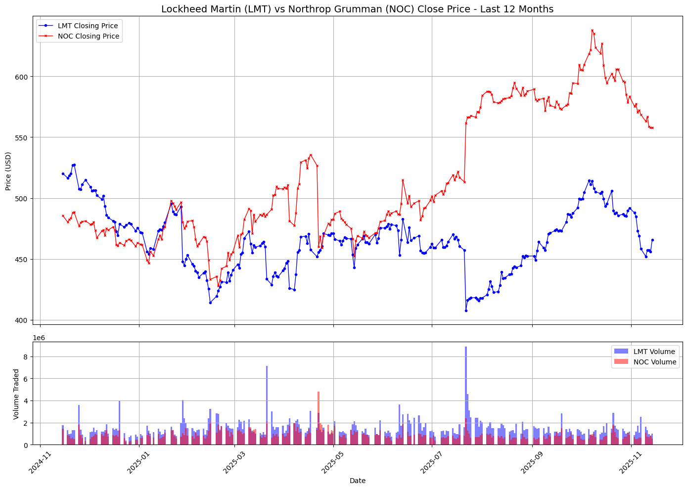
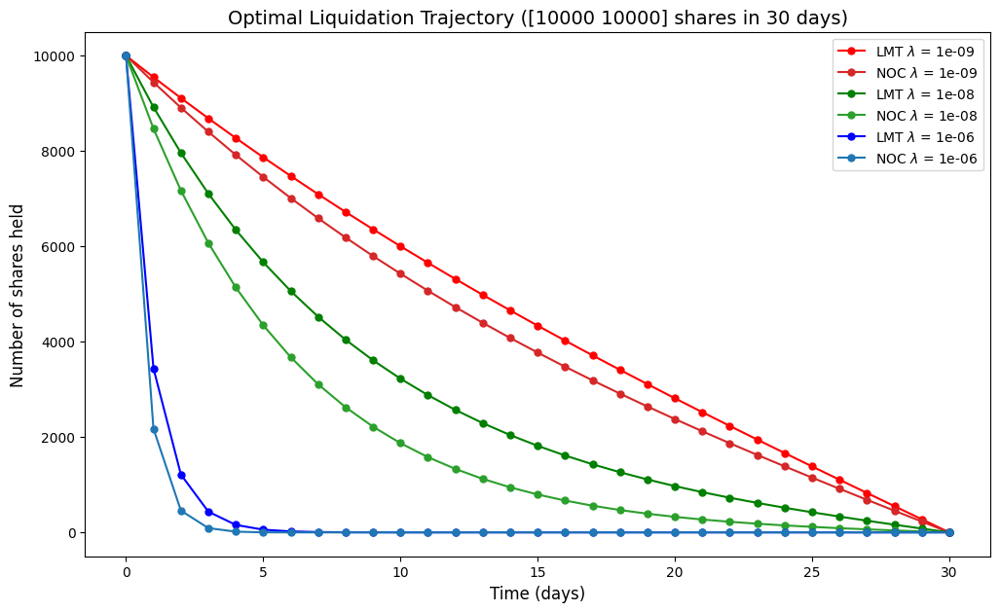

# Almgren–Chriss Optimal Liquidation

This repository contains a short demonstration of the Almgren–Chriss framework for optimal execution (optimal liquidation) and a companion Jupyter notebook `optimal_execution.ipynb` with worked examples.

Overview
--------

The Almgren–Chriss model (Almgren & Chriss, 2000) gives a tractable continuous-time framework to compute an optimal trading schedule that balances expected execution cost (market impact) against the risk from price volatility. It is widely used for slicing large orders into a time series of smaller trades.

Model setup (continuous-time, simplified)
----------------------------------------

- Let $X_t$ be the remaining inventory at time $t$, with $X_0 = Q$ and $X_T = 0$ (fully liquidate by horizon $T$).
- The mid-price evolves as $dS_t = \sigma\,dW_t$ (zero drift, volatility $\sigma$).
- Trades are executed at rate $v_t = -\dot X_t$ (so $v_t \ge 0$ when selling). Temporary market impact shifts the execution price by an amount proportional to the trade rate; the usual parametrization uses a temporary impact coefficient $\eta>0$.

Execution objective
-------------------

We choose a trading schedule $X_t$ to minimize a trade-off between expected cost and risk (variance of cost):

$$
	\text{Minimize } \quad \mathbb{E}[C] + \frac{\lambda}{2}\mathrm{Var}[C]
$$

where $\lambda\ge 0$ is a risk-aversion parameter and $C$ is the total execution cost. Under the simple temporary-impact model the optimal continuous-time solution (no permanent impact) has a closed form.

References
----------

- Almgren, R., & Chriss, N. (2000). Optimal execution of portfolio transactions. Journal of Risk, 3(2), 5–39.

Notes and extensions
--------------------

This repo presents a minimal, canonical version of the Almgren–Chriss model (continuous-time, linear temporary impact, no drift). Many useful extensions exist: permanent impact, nonlinear (power-law) impact, stochastic liquidity, price recovery models, limit order placements, and constrained trading (e.g., max participation rates). The notebook is a simple playground — extend it if you need additional realism for research or production.

